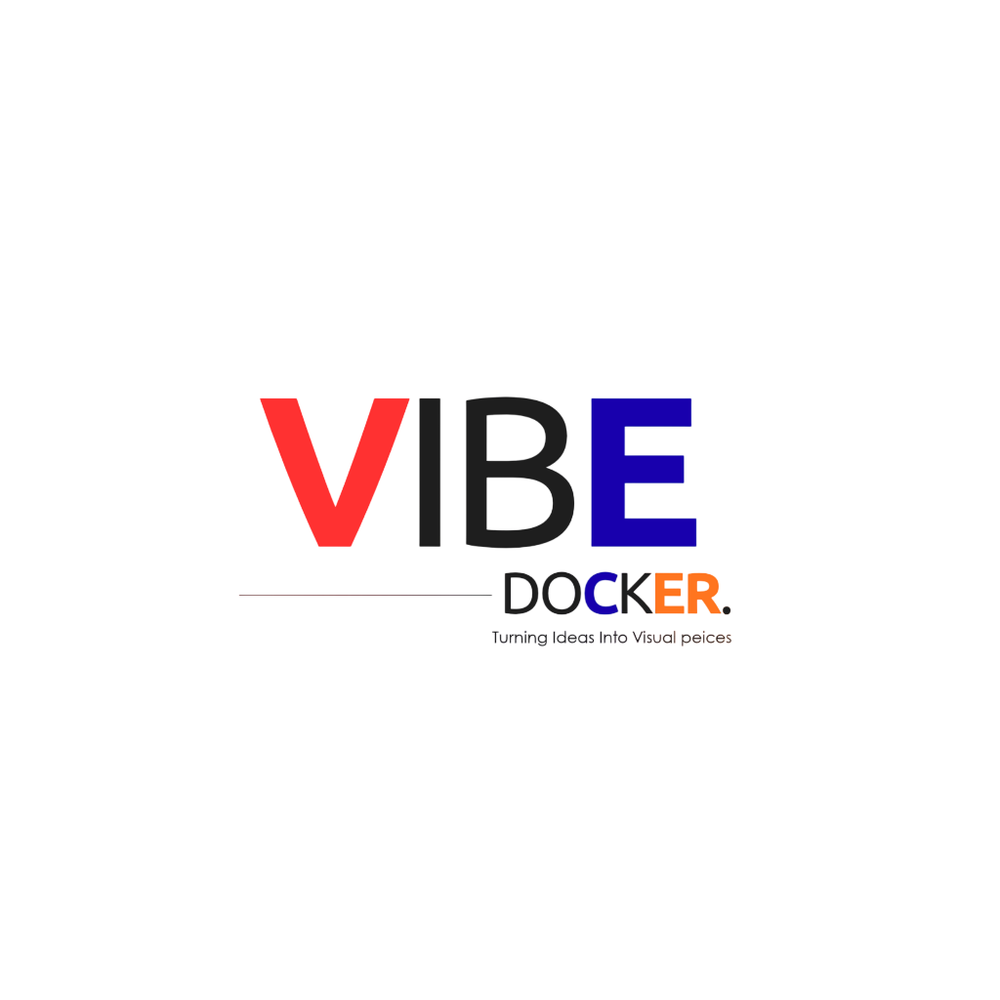
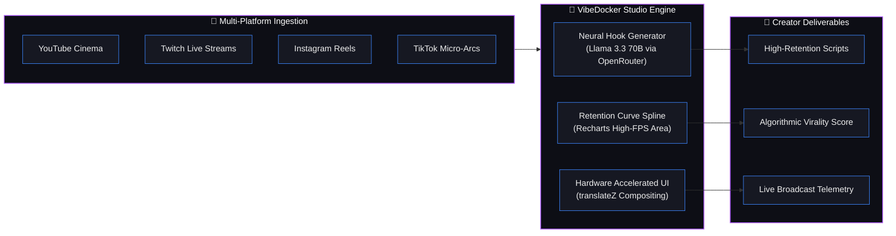

<div align="center">

# ⚡ VibeDocker
### *Turning Ideas Into Visual Pieces*

<br/>

<a href="https://github.com/Rohanjm911/VibeDocker">
  
</a>

<div align="center">
  <div style="display: inline-block; background: #07080e; border: 1px solid rgba(168, 85, 247, 0.4); border-radius: 16px; padding: 18px 24px; box-shadow: 0 0 25px rgba(56, 189, 248, 0.25);">
    
  </div>
</div>

<br/>

[](https://nextjs.org/)
[](https://react.dev/)
[](https://www.typescriptlang.org/)
[](https://tailwindcss.com/)
[](https://www.framer.com/motion/)
[](https://openrouter.ai/)
[](https://twitch.tv/)

<br/>

```
  ┌────────────────────────────────────────────────────────────────────────┐
  │   ✦ NEURAL SCRIPTING   │   ◈ RETENTION VELOCITY   │   ⚡ LIVE RADAR    │
  └────────────────────────────────────────────────────────────────────────┘
```

</div>

<br/>

---


## ✦ System Architecture & Data Flow



---

## 📑 Documentation Quick Links

| Document | Description | Status |
| :--- | :--- | :---: |
| 📖 **[HOW_TO_RUN.md](HOW_TO_RUN.md)** | Step-by-step instructions on installation, env setup, and production run. | `STABLE` |
| 📦 **[PACKAGES_AND_EXTENSIONS.md](PACKAGES_AND_EXTENSIONS.md)** | Package inventory, dependencies, and recommended developer extensions. | `UPDATED` |

---

## 🛠️ Tech Stack & Visual Engineering

VibeDocker is engineered using a modern, performance-first web architecture:

### ⚡ Core Framework & Runtime
- **[Next.js 16 (App Router)](https://nextjs.org/)**: Server Components, streaming SSR, hardware-accelerated transitions, and unified API route handlers.
- **[React 19](https://react.dev/)**: Latest React runtime with concurrent rendering and optimal client state management.
- **[TypeScript 5](https://www.typescriptlang.org/)**: Strict static typing across creator data models, telemetry streams, and API contracts.

### 🎨 Styling & Dynamic Obsidian Aesthetics
- **[Tailwind CSS v4](https://tailwindcss.com/)**: CSS-first utility styling powered by `@tailwindcss/postcss`.
- **Obsidian Theme System**: Deep obsidian spatial grid (`#030305`), sub-micron glassmorphic borders, and hardware-accelerated surface rendering (`translateZ(0)`).
- **Subtle Ambient Illumination**: Gradient meshes, Aurora accent glows, and border radiance.

### 🎬 Motion, Pulse & Hardware Acceleration
- **[Framer Motion 12](https://www.framer.com/motion/)**: Fluid spring-physics modals, interactive cards, and layout animations.
- **[Anime.js 4](https://animejs.com/)**: High-frequency metric tick counters (`AnimeCounter`) and real-time signal telemetry pulse bars (`AnimePulseBar`).
- **[Lucide React](https://lucide.dev/)**: Scalable iconography across all platform navigation and telemetry cards.

### 📊 Data Visualization & AI Engine
- **[Recharts 3](https://recharts.org/)**: Cyber-gradient Area Charts, retention splines, and pacing telemetry.
- **[OpenRouter AI](https://openrouter.ai/)**: Integration with `meta-llama/llama-3.3-70b-instruct:free` for neural hook creation and script engineering.

---

## 🌟 Key Features & Cockpit Modules

```
 ┌─ [01] Command Deck ───────── Real-time Audience Pulse & Live Creator Metrics
 ├─ [02] Neural Hook Engine ─── 3-Second Retention Testing & Algorithmic Bias Predictor
 ├─ [03] Twitch Persona ────── Dedicated Gaming Streamer Cockpit (Priya Patel live)
 ├─ [04] Retention Curve ────── Second-by-Second Video Retention & Spline Radar
 ├─ [05] BrainForge AI ──────── Full-Length Multi-Platform Script Generation
 └─ [06] Interactive Tour ───── Onboarding System Walkthrough for First-Time Users
```

---

## 📂 Project File Structure

```text
VibeDocker/
├── .vscode/
│   └── extensions.json            # Recommended editor extensions
├── app/                           # Next.js 16 App Router directory
│   ├── api/generate-script/       # OpenRouter AI script & hook generation API
│   ├── dashboard/                 # Creator Command Center pages
│   │   ├── layout.tsx             # Persistent Dashboard layout (Sidebar, HeaderBar, Auth guard)
│   │   ├── page.tsx               # Main Dashboard overview & telemetry metrics
│   │   ├── analytics/page.tsx     # Deep-dive audience & performance analytics
│   │   ├── brain/page.tsx         # AI Script Studio & neural idea generator
│   │   ├── calendar/page.tsx      # Multi-platform content release scheduling
│   │   ├── connect/page.tsx       # Platform accounts connection manager (Twitch, YT, IG, X, TikTok)
│   │   ├── settings/page.tsx      # Creator configuration, API keys, and theme settings
│   │   └── virality/page.tsx      # Virality scoring predictor & benchmark tool
│   ├── login/page.tsx             # High-energy login page with instant demo creator profiles
│   ├── globals.css                # Global stylesheet with hardware-accelerated obsidian glass
│   ├── layout.tsx                 # Root HTML shell & metadata
│   └── page.tsx                   # Root landing page (redirects directly to /login)
├── components/
│   ├── dashboard/
│   │   └── LiveContentSimulator.tsx # Real-time interactive AI hook testing simulator
│   └── shared/
│       ├── AnimeCounter.tsx       # Smooth number-tick counter powered by Anime.js
│       ├── AnimePulseBar.tsx      # Pulsing dynamic frequency indicator
│       ├── HeaderBar.tsx          # Top navigation bar with notifications and profile triggers
│       ├── NotificationPopover.tsx# Live notification center with interactive alerts
│       ├── OnboardingModal.tsx    # Interactive introductory tour for first-time visitors
│       ├── ProfilePopover.tsx     # Active creator profile details & persona switcher
│       ├── Sidebar.tsx            # Collapsible navigation drawer with real-time active indicators
│       └── VibeDockLogo.tsx       # Branded vector logo component with new VibeDocker mark
├── lib/
│   ├── useNotifications.ts        # Custom hook for notification feed management
│   ├── useUser.ts                 # Custom hook for creator authentication & Twitch persona state
│   └── utils.ts                   # Utility helper for class merging (clsx + tailwind-merge)
├── public/
│   ├── avatars/                   # Pre-seeded creator avatar portrait photographs
│   ├── brand-logo.png             # Official VibeDocker brand logo asset
│   └── vibedocker-icon.svg        # Branded primary icon asset
├── HOW_TO_RUN.md                  # Comprehensive step-by-step run & deployment guide
├── PACKAGES_AND_EXTENSIONS.md     # Directory of all packages and recommended IDE extensions
└── package.json                   # Project metadata, dependencies, and script definitions
```

---

## ⚡ Quick Start

```bash
# 1. Clone repository
git clone https://github.com/Rohanjm911/VibeDocker.git
cd VibeDocker

# 2. Install dependencies
npm install

# 3. Configure environment variables (Optional - for AI script generation)
cp .env.example .env.local

# 4. Start development server
npm run dev
```

Open **[http://localhost:3000](http://localhost:3000)** in your browser.

---

<div align="center">


**VibeDocker OS** • *Turning Ideas Into Visual Pieces*  
Built for the next generation of digital directors & streaming executives.

</div>
